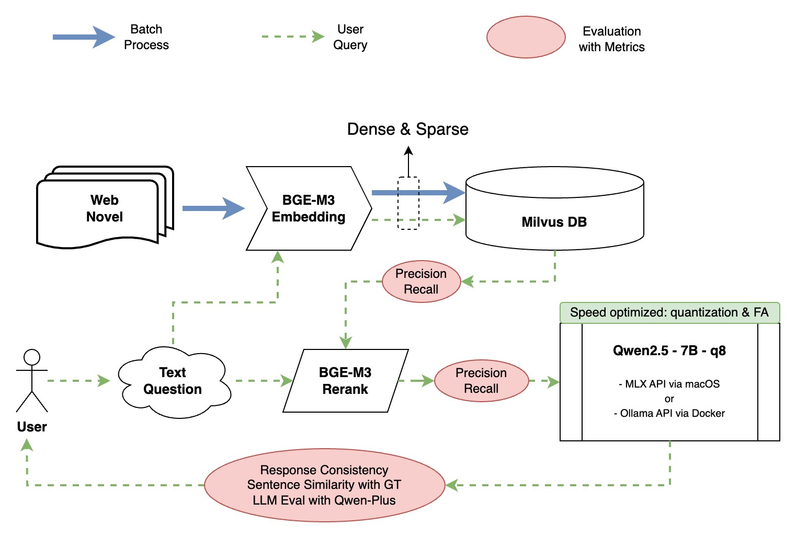

# My-Web-Novel

This is an experimental local RAG project to help people follow slow & infrequent updates of long-series web novel, as a QA wiki.

## System Overview

Refer to the image for a brief system overview leveraging **LlamaIndex**.

The system includes three entrypoints:
- batch processing pipeline via `index.index_document_w_chunk_embed`.
- stream query pipeline via `query.query_stream`
- query with sample eval dataset via `query.query_with_eval_dataset`

## Quick Start
1. Prepare python env using `requirements.txt`
2. Download embedding & LLM models (i.e. Qwen2.5, BGE-m3) to local and modify `configs/config.yaml`. Recommend to use Ollama or MLX for a restful server.
3. We use `Milvus` for vector DB, so get a lite version or a standalone Docker version ready. See sample start-up script in `scripts/`
4. Index your novel and stream query your question in a juoyter notebook with the above entrypoints.
5. Sample evaluation scripts with sample evaluation datasets are in `notebooks/` and `data/eval/` for quick reference.

## ToDos
1. Add a UI for easy interaction